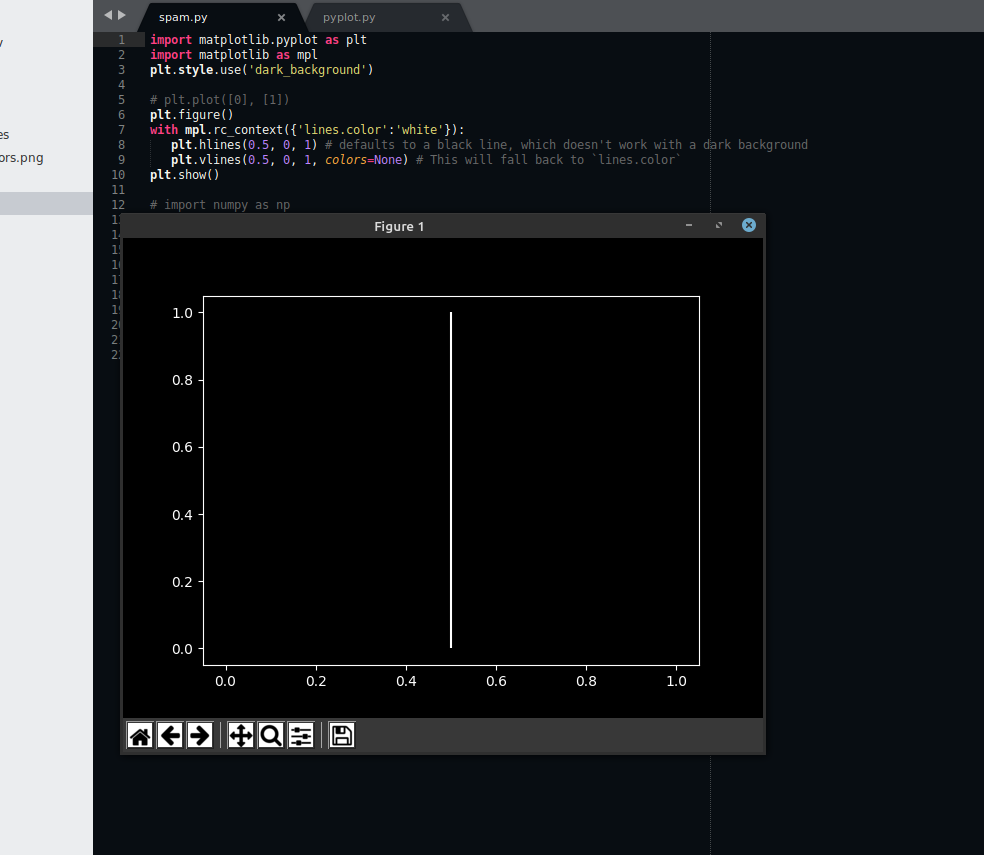
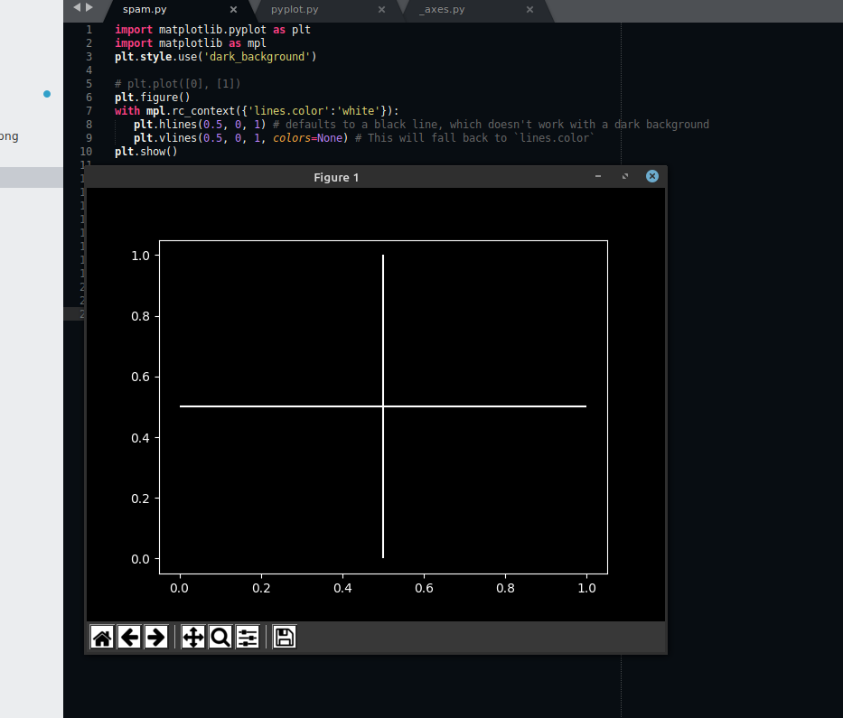
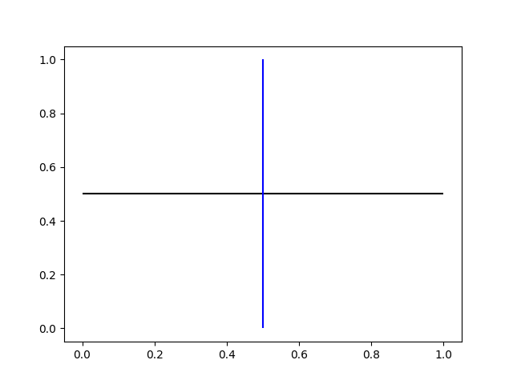
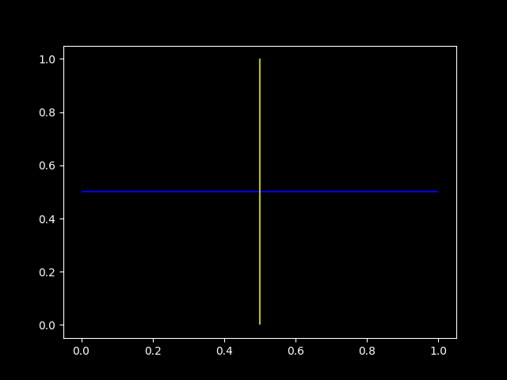
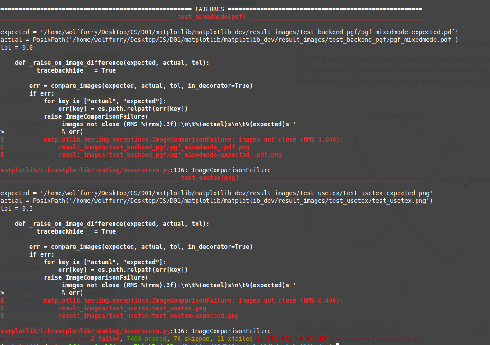
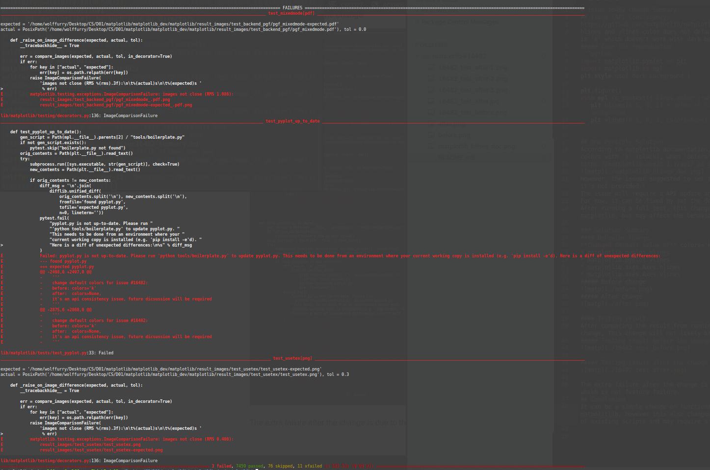
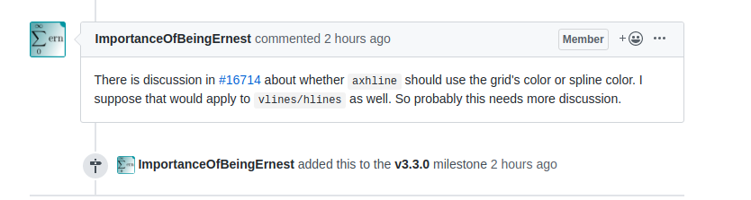

# Issue 16482 Development Process
## [Issue#16482](https://github.com/matplotlib/matplotlib/issues/13799) (API Consistency)
hlines and vlines color does not default to lines.color in rcParams. The default argument is 'k' which doesn't work with dark backgrounds.
##### Code for reproduction
```python
import matplotlib.pyplot as plt
import matplotlib as mpl
plt.style.use('dark_background')

plt.figure()
with mpl.rc_context({'lines.color':'white'}):
   plt.hlines(0.5, 0, 1) # defaults to a black line, which doesn't work with a dark background
   plt.vlines(0.5, 0, 1, colors=None) # This will fall back to `lines.color`
```

## Phase 1 Requirement and Analysis
According to matplotlib documentation, hlines and vlines functions will have a default **colors** of 'k' (black), when **colors** attribute is not provided.\
https://matplotlib.org/3.1.1/api/_as_gen/matplotlib.pyplot.hlines.html\

However, the issuer suggested to set the colors match to the settings in rcRaram when it's not provided.\
The issue will require a API update and need to discuss with the developers.\
Currently, a simple solution can be achieved by setting the default parameter **colors** to **None**.\
Since this solution is relatively trivail, it worthy to take a try and see the potential outcomes.\

## Phase 2 Design and Development
### Development - Behavior change
**Changed default value of** colors='k' **to** colors=None **in the following scripts**
* matplotlib.pyplot.hlines
* matplotlib.pyplot.vlines
* matplotlib.axes.Axes.hlines
* matplotlib.axes.Axes.vlines


## Phase 3 Testing
### Validation
#### Testing result before the change

#### Testing result after the change

After the change, the requirement for the issuer is satisfied.
### Verification
#### Test case 1:
```python
import matplotlib.pyplot as plt
import matplotlib as mpl
plt.figure()
with mpl.rc_context({'lines.color':'blue'}):
   plt.hlines(0.5, 0, 1, colors='k') # defaults to a black line, which doesn't work with a dark background
   plt.vlines(0.5, 0, 1) # This will fall back to `lines.color`
plt.show()
```
##### Expected outcome:
hlines will draw the line with given color, black\
vlines will draw the line with default color in lines.colors, blue
##### Actual outcome:
\
Pass

#### Test case 2:
```python
plt.style.use('dark_background')
plt.figure()
with mpl.rc_context({'lines.color':'blue'}):
   plt.hlines(0.5, 0, 1) # defaults to a black line, which doesn't work with a dark background
   plt.vlines(0.5, 0, 1, colors='y') # This will fall back to `lines.color`
plt.show()
```
##### Expected outcome:
With black background color\
hlines will draw the line with default color in lines.colors, blue\
vlines will draw the line with given color, yellow
##### Actual outcome:
\
Pass

### Integration Test
#### Before change

Currently there are two test cases failures on the head of matplotlib github repo.
#### After change

After comparing the result from running the provides test cases before and after the change, This change will not likely break other features of matplotlib.
The extra failure after the change is due to the version differences of file **pyplot**, which is not feature failure.
## Phase 4 - Deploying
The issue can be a simple change on functions' prototype and will not break other features of matpolitlib, however this also changes the API documentation and may affect the behavior of existing scripts and may require a discussion with the developers.

### Latest update from developers of this issue on Mar 10, 2020 / User feedback
\

More discussion will be on issue#16714\
**Axhline doesn’t cycle through colors #16714**\
https://github.com/matplotlib/matplotlib/issues/16714

