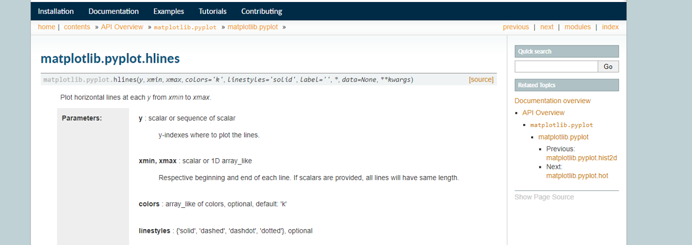
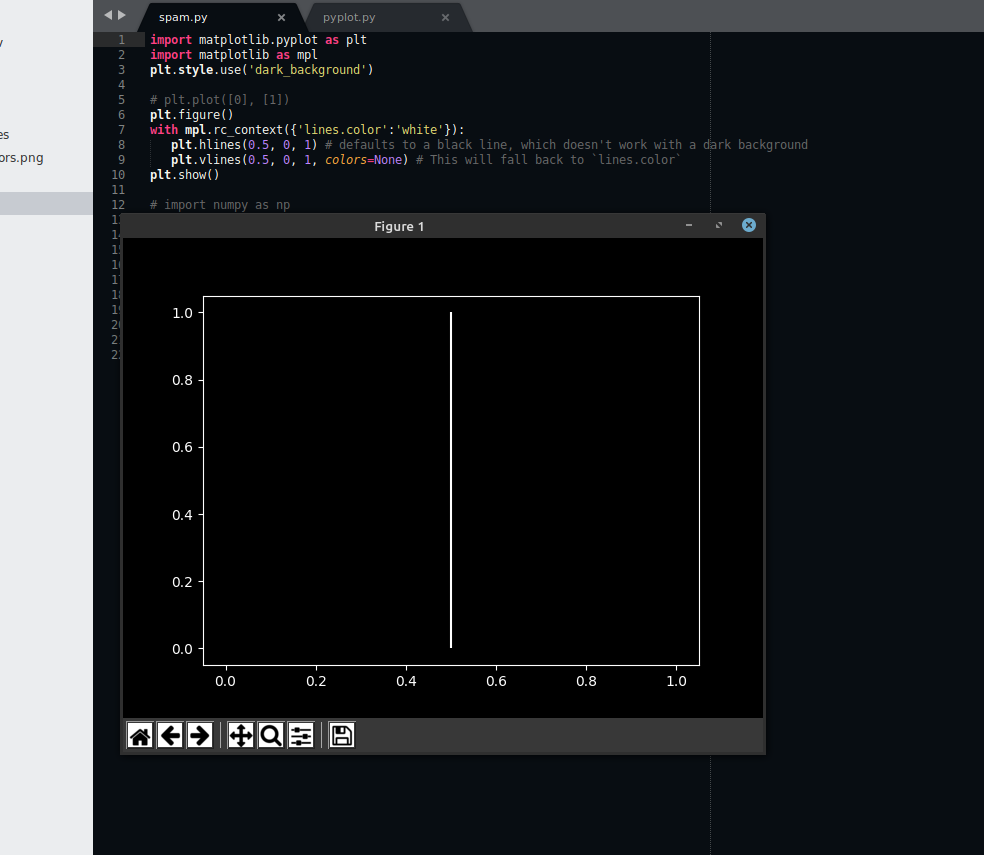
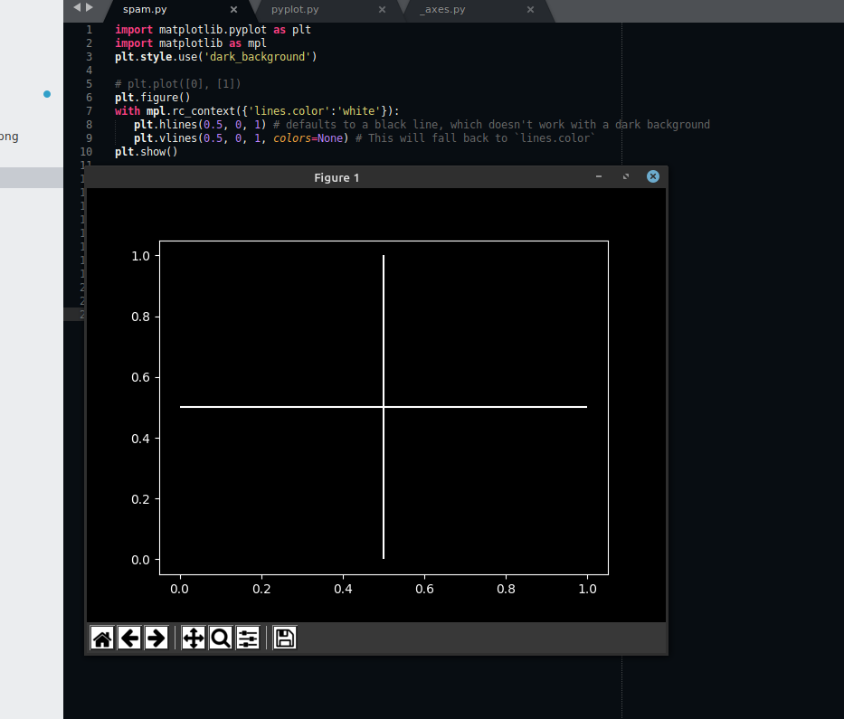
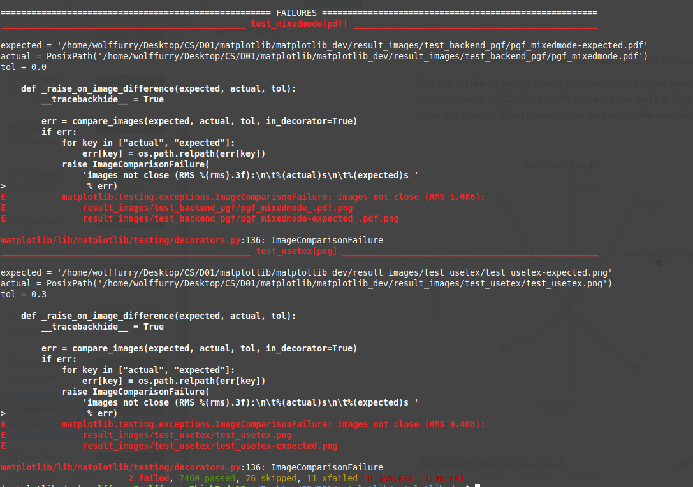
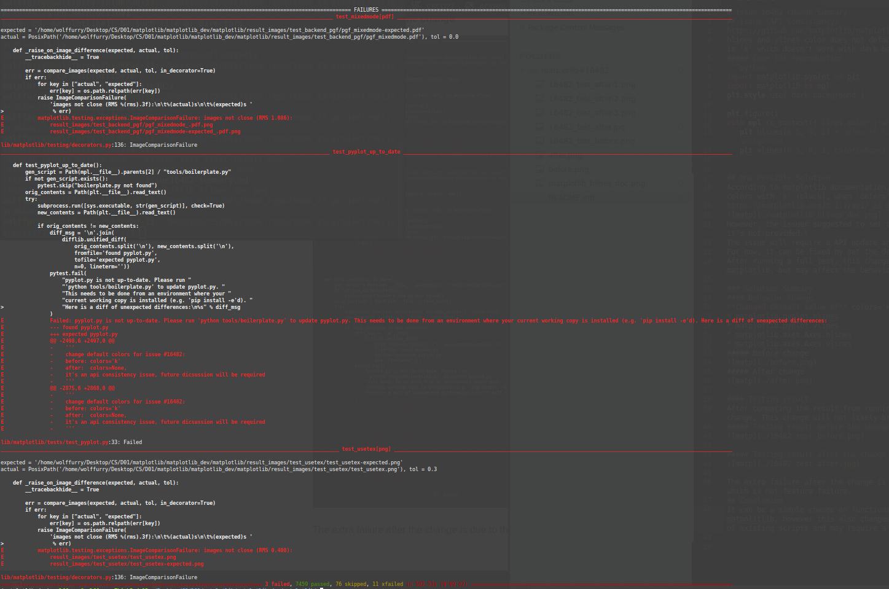

# Issue 16482 Change Summary
## Issue (API Consistency)
https://github.com/matplotlib/matplotlib/issues/16482  
hlines and vlines color does not default to lines.color in rcParams. The default argument is 'k' which doesn't work with dark backgrounds.
##### Code for reproduction
```python
import matplotlib.pyplot as plt
import matplotlib as mpl
plt.style.use('dark_background')

plt.figure()
with mpl.rc_context({'lines.color':'white'}):
   plt.hlines(0.5, 0, 1) # defaults to a black line, which doesn't work with a dark background
   plt.vlines(0.5, 0, 1, colors=None) # This will fall back to `lines.color`
```

## One Possible Solution
According to matplotlib documentation, hlines and vlines functions will have a default **colors** of 'k' (black), when **colors** attribute is not provided.\
https://matplotlib.org/3.1.1/api/_as_gen/matplotlib.pyplot.hlines.html\

However, the issuer suggested to set the colors match to the settings in rcRaram when it's not provided.\
The issue will require a API update and need to discuss with the developers.\
For now, it can be fixed by set the default parameter **colors** to **None**.\
After running a full test, this change will not likely break other features of matplotlib, but may affect the behavior of existing scripts.

### Solution Summary
#### Behavior change
**Changed default value of** colors='k' **to** colors=None **in the following scripts**
* matplotlib.pyplot.hlines
* matplotlib.pyplot.vlines
* matplotlib.axes.Axes.hlines
* matplotlib.axes.Axes.vlines
##### Before change

##### After change


#### Testing result
After comparing the result from running the provides test cases before and after the change, This change will not likely break other features of matplotlib.
##### Testing result before the change


##### Testing result after the change


The extra failure after the change is due to the version differences of file **pyplot**, which is not feature failure.
## Conclusion
It can be a simple change on functions' prototype and will not break other features of matpolitlib, however this also changes the API documentation and may affect the behavior of existing scripts and may require a discussion with the developers.

