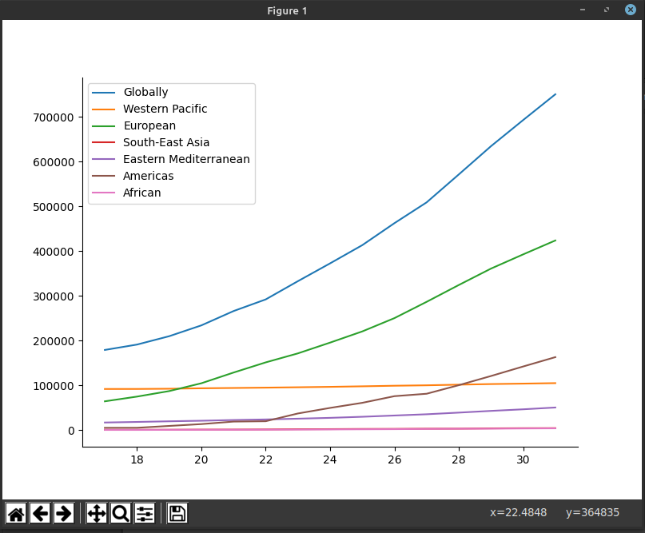
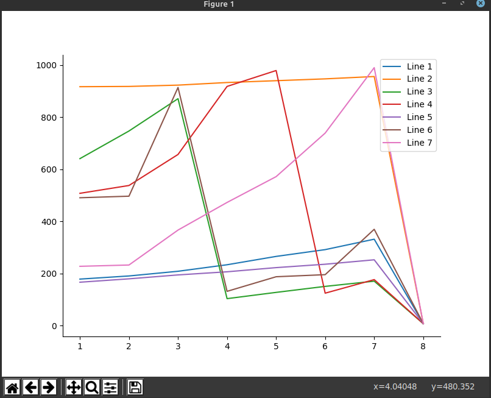
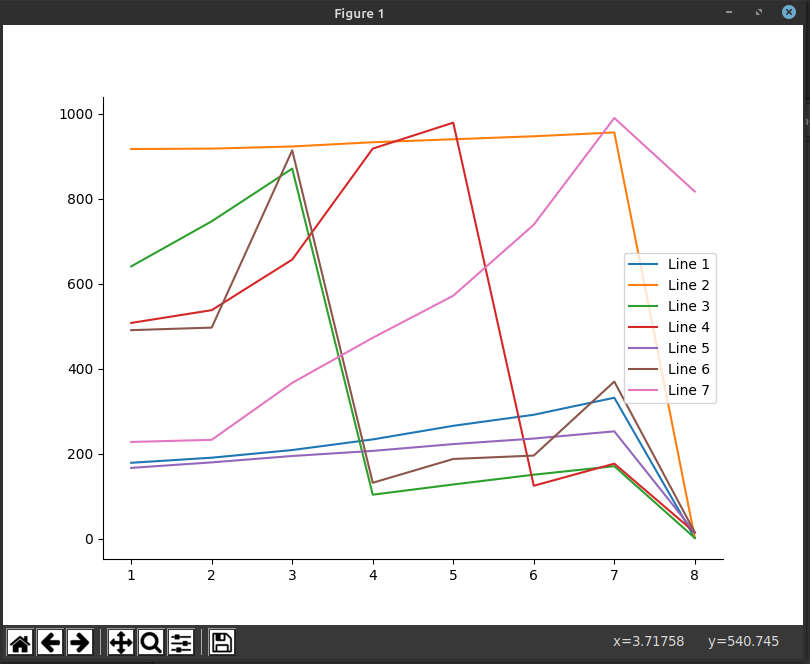

## Acceptance Test
The feature that the user wants is to label the lines near the end of each line. An example result from user's posting will be like\
\
Our acceptance tests contain a set of line graphs, before the implementation, they are labeled using the _legend()_ function. After the implementation, the graphs should have their label at the end of each line.
### Real world statistic graphs scenarios
#### How much food can you buy for working one hour in the manufacturing sector
Using _legend()_ function:
\

#### Domestic food price volatility index
Using _legend()_ function:
\

#### COVID19 data on second half of month March
Using _legend()_ function:
\

#### Commodity price index of cereal crops and petroleum 1850 2015
Using _legend()_ function:
\

#### Percent bachelors degrees women USA
Using _legend()_ function:
\

### Tests for edge cases graphs scenarios
#### All lines ends at close points
Using _legend()_ function:
\

#### Lines ends at different close points
Using _legend()_ function:
\

## Acceptance Test Result
After the implementation of our feature, users will be able to label the lines at the end of each line in a decent way.\
Instead of _lengend()_, users will call the newly implemented function _label_lines()_. The function will place the line labels at the end of each line in a responsive manner. Users can zoom the graph to get a decent label position for lines ends at close points. By running the test cases above using the _label_lines()_ function, the following graphs are produced.
### Real world statistic graphs scenarios
#### How much food can you buy for working one hour in the manufacturing sector
Using _label_lines()_ feature:
\

#### Domestic food price volatility index
Using _label_lines()_ feature:
\
When the graph contains a lot of lines, our feature will try to group labels for lines that have similar end points. Users can zoom into the graph and the labels position will update accordingly. After zoom into the above messy graph, we will get a better labeled graph as follow.
\
With further zoom in, the labels can be clearly showed. 
\

#### COVID19 data on second half of month March
Using _label_lines()_ feature:
\

#### Commodity price index of cereal crops and petroleum 1850 2015
Using _label_lines()_ feature:
\

#### Percent bachelors degrees women USA
Using _label_lines()_ feature:
\

### Tests for edge cases graphs scenarios

#### All lines ends at close points
Using _label_lines()_ feature:
\
After zoom into the end points of the lines:\
\

#### Lines ends at different close points
Using _label_lines()_ feature:
\
After zoom into the end points of the lines:\
\
Further zoom until the label is clear:\
\

#### Max number of labels
The max number of labels can be shown in a graph:\
\
#### Label density
Labels when lines end at the same point:\
\

